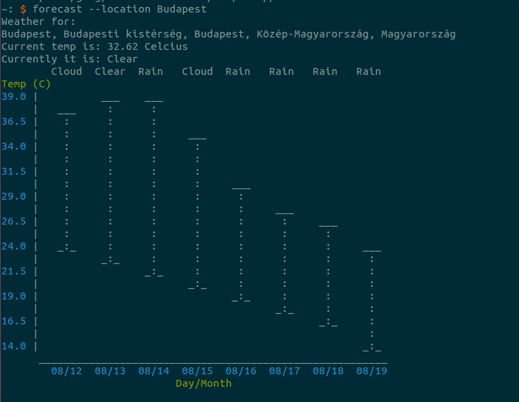

# forecast

This is a fork of Jody White's [pyweather](http://github.com/jhwhite/pyweather)
which:

>Uses Geopy to convert (almost) any location into Latitude and Longitude
>coordinates, and then use those coordinates to look up the weather conditions.

This fork create a command line program which outputs the forecast to the
terminal.

To use this, you will need an api key from Forecast.io which can be found by
registering [here](https://developer.forecast.io)

## Installation

Clone the source, then

    python setup.py install

On the first use, you will be asked for the API key found on [the forecast
wbesite](https://developer.forecast.io). The API key is stored in
`~/.pyweatherrc` and can be edited manually, or accesed through the command
line flags (see `forecast -h`).

## Usage

Typical usage consists of calling with either the `-l` or equivalently the
`--location` flag for example:

A location will be requested if none is given.

## ToDo

* Improve and finish ASCII weather symbols
* Add a default location to the rc file

